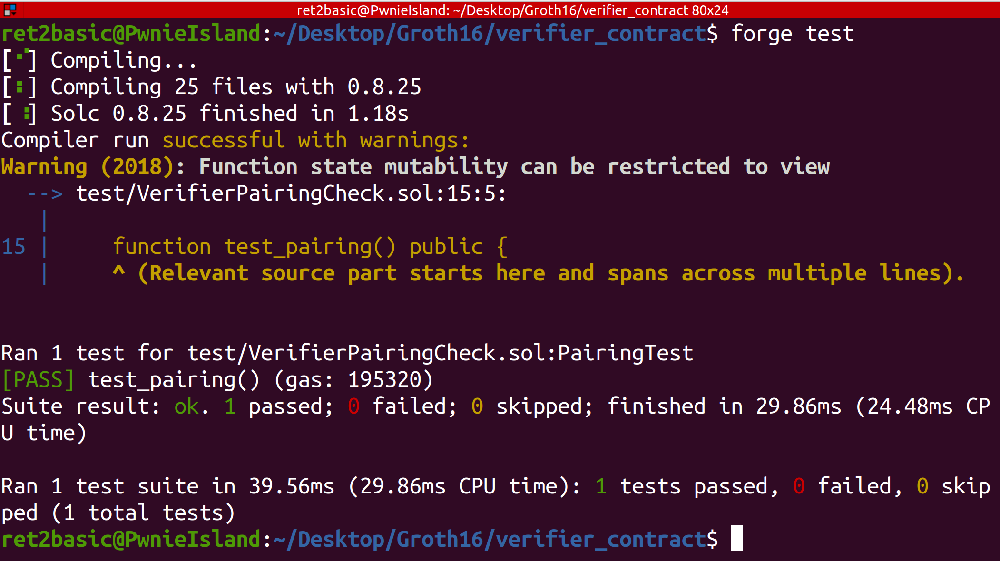

# Groth16 Zero-Knowledge Proof System

A complete implementation of the Groth16 zk-SNARK protocol from scratch in Python, demonstrating zero-knowledge proofs for graph bipartite coloring. Final project of RareSkills ZK bootcamp cohort 8.

## Overview

This project implements the Groth16 zero-knowledge proof system, one of the most efficient zk-SNARK constructions used in practice. The implementation demonstrates proving that a graph is bipartite (2-colorable) without revealing the actual coloring.

### Key Features

- **Complete Groth16 Implementation**: From constraint generation to proof verification
- **Educational Focus**: Well-documented code with clear explanations of each step
- **BN128 Elliptic Curve**: Uses the standard curve for Ethereum-compatible proofs
- **Solidity Verifier**: Includes an on-chain verifier contract for Ethereum deployment

## Quick Start

### Run Trusted Setup and Prover

```bash
python3 groth16.py
```

### Run Verifier

```bash
cd verifier_contract
forge test
```

## Proof of Concept

### Prover Success


### Verifier Success


## Problem Design

The implementation solves a graph bipartite problem for a 4-vertex graph:
- **Vertices**: x₁, x₂, x₃, x₄
- **Edges**: (x₁,x₂), (x₁,x₄), (x₂,x₃)
- **Goal**: Prove the graph can be 2-colored (bipartite) without revealing the coloring

The problem is encoded as arithmetic constraints and converted to R1CS matrices, then processed through the Groth16 protocol to generate a succinct, zero-knowledge proof.

## Mathematical Background

### Constraint System

1. **Color Constraints**: Each vertex must be colored 1 or 2
   - `(xᵢ - 1)(xᵢ - 2) = 0` for i ∈ {1,2,3,4}

2. **Edge Constraints**: Adjacent vertices have different colors
   - `xᵢ × xⱼ = 2` for each edge (i,j)

### R1CS to QAP Conversion

The R1CS matrices are converted to polynomials via Lagrange interpolation, enabling efficient proof generation through polynomial arithmetic.

### Proof Generation

The prover generates three group elements:
- **A**: Encodes the left side of constraints
- **B**: Encodes the right side of constraints
- **C**: Encodes the output with quotient polynomial

### Verification

The verifier checks a single pairing equation:
```
e(A, B) = e(α, β) · e(public_inputs, γ) · e(C, δ)
```

## Project Structure

```
Groth16/
├── groth16.py                    # Main Groth16 implementation
├── requirements.txt              # Python dependencies
├── README.md                     # Documentation
├── asset/                        # Proof verification screenshots
│   ├── Prover_success.png
│   └── Verifier_success.png
└── verifier_contract/            # Solidity verifier
    ├── src/
    │   └── VerifierPairingCheck.sol
    ├── test/
    │   └── VerifierPairingCheck.sol
    └── foundry.toml
```

## Installation

### Prerequisites

- Python 3.8+
- pip package manager
- Foundry (for Solidity testing)

### Setup

1. **Clone the repository**:
```bash
git clone <repository-url>
cd Groth16
```

2. **Install Python dependencies**:
```bash
pip install -r requirements.txt
```

3. **Install Foundry** (for contract testing):
```bash
curl -L https://foundry.paradigm.xyz | bash
foundryup
```

## Implementation Details

### Trusted Setup Phase
- Generates powers of tau: `[τ⁰]₁, [τ¹]₁, ..., [τⁿ]₁`
- Creates shifted elements: `[α]₁, [β]₂`
- Produces hiding factors: `[γ]₂, [δ]₂`

### Proving Phase
- Computes witness polynomial evaluations
- Applies random blinding factors (r, s)
- Generates proof tuple (A, B, C)

### Verification Phase
- Uses elliptic curve pairings
- Checks single equation for proof validity
- Supports on-chain verification via Solidity

## Security Considerations

⚠️ **Important**: This implementation is for educational purposes. For production use:
- Implement secure random number generation
- Use proper toxic waste disposal protocols
- Add comprehensive input validation
- Consider using audited libraries

## Dependencies

- **numpy**: Numerical computations and matrix operations
- **galois**: Finite field arithmetic over large primes
- **py_ecc**: BN128 elliptic curve operations and pairings

## References

- [Groth16 Original Paper](https://eprint.iacr.org/2016/260.pdf)
- [RareSkills ZK Book](https://www.rareskills.io/post/groth16)
- [Ethereum BN128 Precompiles](https://github.com/ethereum/EIPs/blob/master/EIPS/eip-197.md)

## Contributing

Contributions are welcome! Please submit issues or pull requests for improvements.

## License

MIT License

## Acknowledgments

- Jens Groth for the original Groth16 construction
- RareSkills for the excellent ZK bootcamp
- Ethereum Foundation for BN128 curve specifications