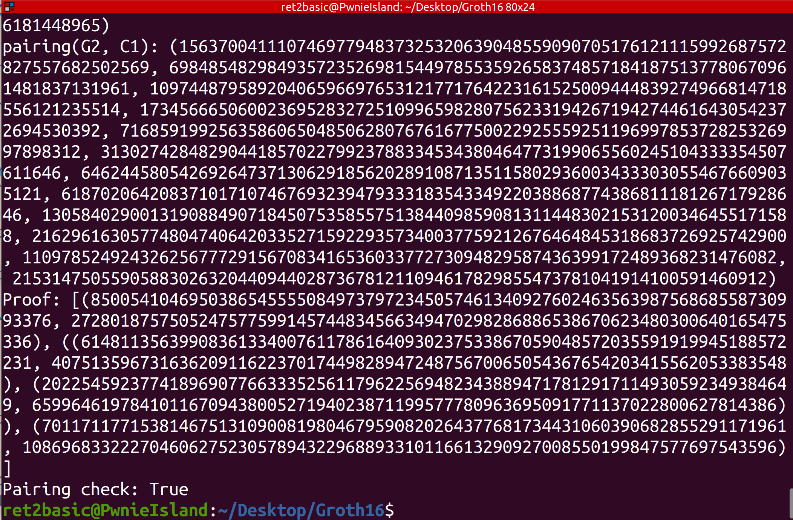

# Groth16

Groth16 implementation in Python. Final project of RareSkills ZK bootcamp cohort 8.

## Instructions

Run trusted setup and prover steps:

```shell
python3 groth16.py
```

Run verifier steps:

```shell
cd verifier_contract

forge test
```

Proof of concept:




## Design

To make the engineering part easier, this groth16 implementation only works for a simple graph bipartite problem. Imagine there are 4 nodes x1, x2, x3, x4. x1 and x3 on top and x2 and x4 on bottom. Our goal is to prove that x1/x3 are in a "group" and x2/x4 are in the other "group".

Another way to view this problem is, we color all vertices with 2 colors and make sure vertices from different "groups" have different colors. For example, we can color x1/x3 as red and x2/x4 as green.

We turn this problem into arithmetic circuits by hand, also build R1CS matrices by hand. The program starts here, and in the end prover produces a succicct proof and verifier can verify it efficiently, in a zero knowledge way.
